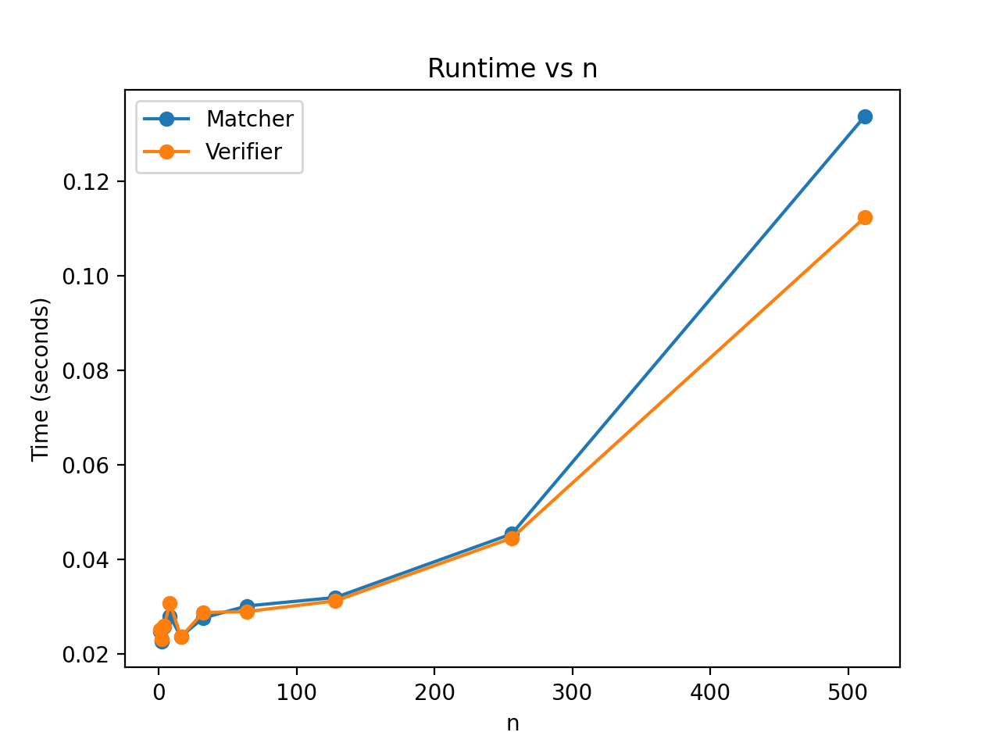

## Assignment 1 **COP4533**

Harrison Chojnowski: `46524954`
Pranav Annapareddy: `21340719`

#### Running Our Code
Create a conda/mamba env or venv with `python>=3.9`

Once that environment is active, run,
```bash
pip install -e
```
from the project root.

---

The script `run_all.sh` will regenerate our benchmark results + plots, run a test using `data/example.in` and `data/example.out`, and will run our `pytests`.

You may also run these individually with,
```bash
python analysis/benchmark.py
python analysis/plot_runtime.py
pytest
```

```
python main.py -i data/example.in -o data/example.out -v
```
The `-i/--input` flag is required. The input is your input text file path.
The `-o/--output` flag is optional. The output flag is your output text file path.
The `-v/--verify` flag is optional. When given, it runs the verifier code (one-to-one and is stable checks) on the Gale-Shapely algorithms outputs.

#### Assumptions

Example input
```
3
1 2 3
2 3 1
2 1 3
2 1 3
1 2 3
1 2 3
```

Example output
```
1 2
2 3
3 1
```

Make sure you ran `pip install -e .` or these programs will not work.

#### Analysis/Results (Task C)


The graph shows that both the matcher and the verifier are rougly exponenetial $O(n^d)$, and given our algorithmic implementations, it should be $d=2$ so both the matcher and verifier are $O(n^2)$.